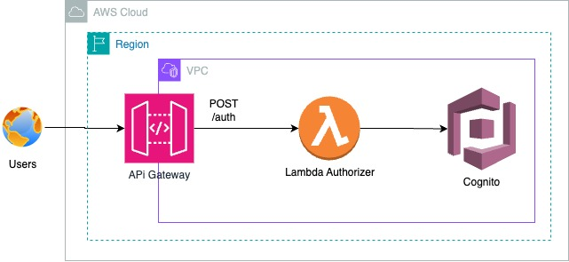

# lambda-authorized

This project contains source code and supporting files for a serverless application that you can deploy with the SAM CLI. It includes the following files and folders.

- LambdaAuthorizeFunction/src/main - Code for the application's Lambda function.
- events - Invocation events that you can use to invoke the function.
- LambdaAuthorizeFunction/src/test - Unit tests for the application code. 
- template.yaml - A template that defines the application's AWS resources.

The application uses several AWS resources, including Lambda functions and an API Gateway API. These resources are defined in the `template.yaml` file in this project. You can update the template to add AWS resources through the same deployment process that updates your application code.

## Deploy the sample application

The Serverless Application Model Command Line Interface (SAM CLI) is an extension of the AWS CLI that adds functionality for building and testing Lambda applications. It uses Docker to run your functions in an Amazon Linux environment that matches Lambda. It can also emulate your application's build environment and API.

To use the SAM CLI, you need the following tools.

* SAM CLI - [Install the SAM CLI](https://docs.aws.amazon.com/serverless-application-model/latest/developerguide/serverless-sam-cli-install.html)
* Java11 - [Install the Java 11](https://docs.aws.amazon.com/corretto/latest/corretto-11-ug/downloads-list.html)
* Maven - [Install Maven](https://maven.apache.org/install.html)
* Docker - [Install Docker community edition](https://hub.docker.com/search/?type=edition&offering=community)

To build and deploy your application for the first time, run the following in your shell:

```bash
sam validate
sam build
sam deploy --region="{AWS::Region}"
```

## Use the SAM CLI to build and test locally

Build your application with the `sam build` command.

```bash
lambda-authorized$ sam build
```

The SAM CLI installs dependencies defined in `LambdaAuthorizeFunction/pom.xml`, creates a deployment package, and saves it in the `.aws-sam/build` folder.

Test a single function by invoking it directly with a test event. An event is a JSON document that represents the input that the function receives from the event source. Test events are included in the `events` folder in this project.

Run functions locally and invoke them with the `sam local invoke` command.

```bash
lambda-authorized$ sam local invoke LambdaAuthorizeFunction --event events/event.json
```

The SAM CLI can also emulate your application's API. Use the `sam local start-api` to run the API locally on port 3000.

```bash
lambda-authorized$ sam local start-api
lambda-authorized$ curl http://localhost:3000/
```

The SAM CLI reads the application template to determine the API's routes and the functions that they invoke. The `Events` property on each function's definition includes the route and method for each path.

```yaml
    Events:
    Authentication:
      Type: Api
      Properties:
        Path: /auth
        Method: post
```

### Set up the following steps before proceeding with your authentication: 

1) Access AWS Cognito
2) Access the Pool
3) Create a new user:
   - Enter the desired CPF in the username field.
   - Provide the desired email and mark it as already validated.
   - Enter the desired password.
   - Build the JSON below to execute in Lambda.

### JSON for Test
```
{
  "body": "{\"cpf\": \"04574285036\", \"password\": \"Test@1234\"}"
}
```

## Add a resource to your application
The application template uses AWS Serverless Application Model (AWS SAM) to define application resources. AWS SAM is an extension of AWS CloudFormation with a simpler syntax for configuring common serverless application resources such as functions, triggers, and APIs. For resources not included in [the SAM specification](https://github.com/awslabs/serverless-application-model/blob/master/versions/2016-10-31.md), you can use standard [AWS CloudFormation](https://docs.aws.amazon.com/AWSCloudFormation/latest/UserGuide/aws-template-resource-type-ref.html) resource types.

## Fetch, tail, and filter Lambda function logs

To simplify troubleshooting, SAM CLI has a command called `sam logs`. `sam logs` lets you fetch logs generated by your deployed Lambda function from the command line. In addition to printing the logs on the terminal, this command has several nifty features to help you quickly find the bug.

`NOTE`: This command works for all AWS Lambda functions; not just the ones you deploy using SAM.

```bash
lambda-authorized$ sam logs -n HelloWorldFunction --stack-name lambda-authorized --tail
```

You can find more information and examples about filtering Lambda function logs in the [SAM CLI Documentation](https://docs.aws.amazon.com/serverless-application-model/latest/developerguide/serverless-sam-cli-logging.html).

## Unit tests

Tests are defined in the `LambdaAuthorizeFunction/src/test` folder in this project.

```bash
lambda-authorized$ cd LambdaAuthorizeFunction
HelloWorldFunction$ mvn test
```

## Cleanup

To delete the sample application that you created, use the AWS CLI. Assuming you used your project name for the stack name, you can run the following:

```bash
sam delete --stack-name lambda-authorized OR sam delete
```

## Architecture Cloud AWS


*Caption: This is an example image of the authentication flow in Lambda.*

### Group
- [Thales Jolo](https://github.com/orgs/tech-challenge-team-fiap/people/thalesjolo)
- [Erikson Bastos](https://github.com/orgs/tech-challenge-team-fiap/people/EriksonB)
- [Samuel Almeida](https://github.com/orgs/tech-challenge-team-fiap/people/samucatezu)
- [Jair Cavalcante](https://github.com/orgs/tech-challenge-team-fiap/people/jaircavalcante)
- [Diego Fontgalland](https://github.com/orgs/tech-challenge-team-fiap/people/fontgalland)

